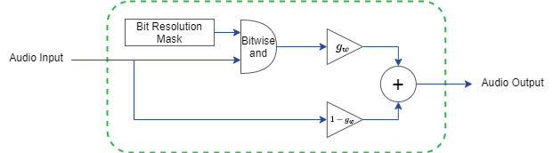

# Bitcrusher
This design implements a basic [bitcrusher](https://en.wikipedia.org/wiki/Bitcrusher), which produces distortion by reducing the audio's resolution. This model was developed using the Frost Autogen Framework and deployed to an Audio Mini using Frost Edge. To set up Frost Autogen or Frost Edge, please review the [Getting Started Guides](https://github.com/fpga-open-speech-tools/docs/tree/master/getting_started). 

## Usage
 - `Enable`: Enable or disable the bitcrusher sound effect. In a disabled state, audio is passed directly through the system.
 - `Bits`: The desired audio resolution in number of bits (e.g. 8 bits)
 - `Wet Dry Mix`: The ratio of the original audio (dry) to the processed signal (wet). This value should range between 0 and 1 where 0 passes only the original audio and 1 passes only the modified signal.
 
## Implementation
The bitcrusher reduces the apparent resolution of the audio by AND'ing the audio samples with a bit resolution mask. For example, a 24-bit audio sample would be reduced to 8-bits of resolution by performing a bit-wise AND with the mask `0xFF0000`.

  

