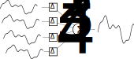

git # Delay and Sum Beamformer
This model implements a delay and sum beamformer, intended for use with the [Audio Logic Microphone Array](https://fpga-open-speech-tools.github.io/ab_mic_array.html). In audio applications, beamforming is a spatial filtering technique in which an array of microphones is used to "focus" on signals coming from a particular direction. 

This model was developed using the Frost Autogen Framework, and can be manually deployed to an Audio Research or Audio Blade. To set up Frost Autogen, please review the [Getting Started Guides](https://github.com/fpga-open-speech-tools/docs/tree/master/getting_started).

## Algorithm
The basic idea behind [beamforming](https://en.wikipedia.org/wiki/Beamforming) is that the outputs of each microphone can be combined in such a way that signals from a given direction add *constructively*, while signals from all other directions add *destructively*. The delay and sum beamformer accomplishes this by delaying the microphone outputs relative to each other. The following figure shows the basic idea:

  

## Usage
- `Azimuth`: The horizontal steering angle in degrees (audio coming from this direction is reinforced); this ranges between +/-90 degrees.
- `Elevation`: The vertical steering angle in degrees (audio coming from this direction is reincofreced); this ranges between +/-90 degrees.

## Implementation
The following block diagram shows a high-level view of the implementation.

  

In general, the desired delays are not integer multiples of the sampling period, so interpolation must be performed. To conserve memory usage, the desired delays are split into their integer and fractional parts. The delays are computed using sin and cosine lookup tables that were created with MATLAB's [Fixed-point Lookup Table Optimizer](https://www.mathworks.com/help/fixedpoint/ref/lookuptableoptimizer.html); these lookup tables take advantage of the quarter-wave symmetry of sin and cosine.  