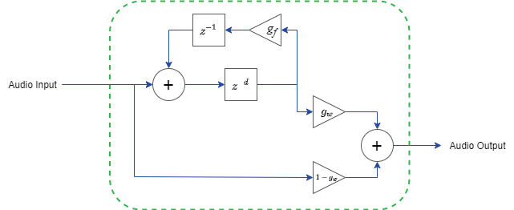

# Echo with Feedback
This design showcases a simple echo audio effect with a feedback loop based off the Mathworks example [Delay-Based Audio Effects](https://www.mathworks.com/help/audio/ug/delay-based-audio-effects.html). This model was developed using the Frost Autogen Framework and deployed to an Audio Mini using Frost Edge. To set up Frost Autogen or Frost Edge, please review the [Getting Started Guides](). 

## Usage
 - `Enable`: Enable or disable the echo sound effect.  In a disabled state, audio is passed directly through the system.
 - `Delay`: The echo delay (in samples)
 - `Feedback`: The gain of the echo feedback,  . 
 - `Wet Dry Mix`: The ratio of the original audio (dry) to the echo signal (wet).  This value should range between 0 and 1 where 0 passes only the original audio and 1 passes only the delayed feedback signal.
 
## Implementation
This design implements a simple echo sound effect using a variable delay, feedback loop, and several gains as shown in the following figure.  The variable delay implementation is particularly useful as it provides an example of using dual-port RAMs to create effects and interface with registers.

  

