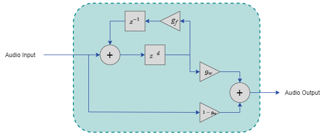

# Example Echo with Feedback
This design showcases a simple echo audio effect with a feedback loop based off the Mathworks example [Delay-Based Audio Effects](https://www.mathworks.com/help/audio/ug/delay-based-audio-effects.html).

## Requirements
1. Configure the [FrOST Software](https://github.com/fpga-open-speech-tools/docs/blob/master/getting_started.md)

## Building the Project
1. Open MATLAB and navigate to `[FrOST Repos]\simulink_models\config\`
2. Run `pathSetup.m`
3. Select `Normal` in the Simulation mode box then click the `Run` button in the toolbar
4. Click the green `Generate VHDL` button in the `echo` tab

## Deploying to S3
Follow the instructions for deploying to Amazon S3  [here]( https://github.com/fpga-open-speech-tools/docs/blob/docs-refactor/getting_started/getting_started_frost_edge_s3.md), taking note to upload the echo equivalent files.

## Usage
### Controls
 - `Enable`: Enable or disable the echo sound effect.  In a disabled state, audio is passed directly through the system.
 - `delay`: The echo delay (in samples)
 - `feedback`: The gain of the echo feedback, . 
 - `wet_dry_mix`: The ratio of the original audio (dry) to the echo signal (wet).  This value should range between 0 and 1 where 0 passes only the original audio and 0 passes only the delayed feedback signal.
 
## Implementation
This design implements a simple echo sound effect using a variable delay, feedback loop, and several gains as shown in the following figure.  The variable delay implementation is particularly useful as it provides an example of using dual-port RAMs to create effects and interface with registers.

  

