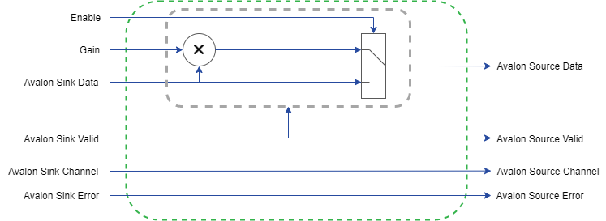

# Simple Gain
This example design shows the implementation of a simple audio gain control using the Avalon streaming interface.  To set up Frost Autogen or Frost Edge, please review the [Getting Started Guides](https://github.com/fpga-open-speech-tools/docs/tree/master/getting_started). 

## Usage
 - `enable`: Enable or disable the gain control. In a disabled state, audio is passed directly through the system.
 - `gain`: The amount of gain applied to the audio signal.  
 
## Implementation
The simple gain model implements the Avalon data, channel, valid, and error signals and uses a gain value and an enable signal from user controls to modify an audio signal.  This signal is directly multiplied by the gain value which is then passed out of the dataplane when the enable is 1.  When the enable is 0, the original audio is passed through the dataplane.  A key feature of this model is that the processing only occurs on the rising edge of the valid signal.

  

