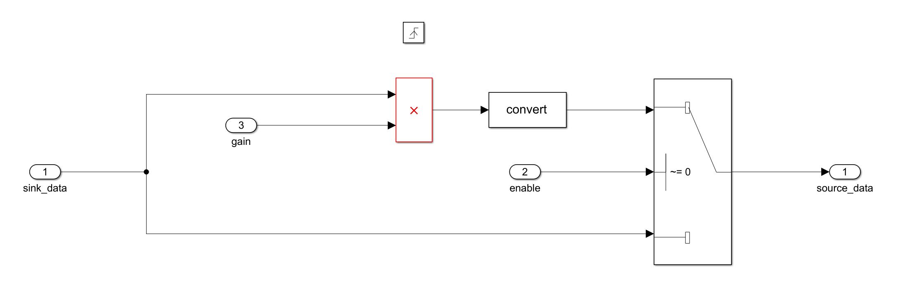

# Channel Based Simple Gain
This simple gain model is implemented using channel based processing. 
## Usage
- `Enable`: The enable and disable toggle will pass the audio through the simple gain block or by pass it.
- `gain`: The gain register will change the multiplication factor in the model.

## Implementation
Since there is not data every clock cycle, the simple gain block is triggered when there is valid audio data. To validate the model, comment out the `Trigger` and set `mp.sim_verify = 1;` in *modelparameters.m*.

  

