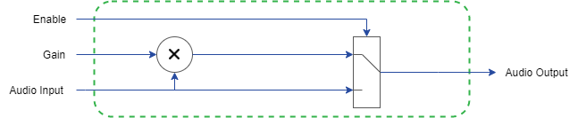

# Simple Vector Gain
This example design shows the implementation of a simple audio gain control using a single multiplexed data signal.  To set up Frost Autogen or Frost Edge, please review the [Getting Started Guides](https://github.com/fpga-open-speech-tools/docs/tree/master/getting_started). 

## Usage
 - `enable`: Enable or disable the gain control. In a disabled state, audio is passed directly through the system.
 - `gain`: The amount of gain applied to the audio signal.  
 
## Implementation
The simple gain model takes an audio signal and both a gain value and an enable signal from user controls.  The audio signal is directly multiplied by the gain value which is then passed out of the dataplane when the enable is 1.  When the enable is 0, the original audio is passed through the dataplane.

  

