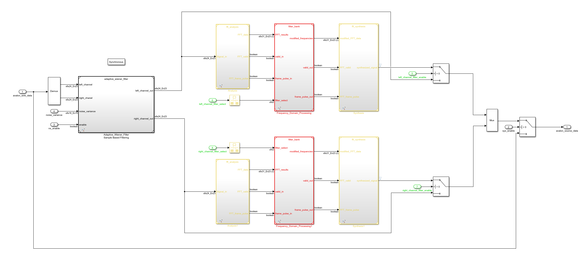

# A Simple Hearing Aide
This simple hearing aide example is a combination of the [Adaptive Wiener Filter Noise Suppression Model](../noise_suppression) and the [FFT Filter Model](../fft_filters).

## Usage
- `System Enable`: The first enable and disable toggle will pass the audio through the simple hearing aide or by pass it.
- **Noise Suppression Controls**:
    - `Noise Suppression Enable`: The second enable and disable toggle turn on or off the noise suppression component
    - `Noise Variance`: The amount of noise suppression can be varied at runtime, which ranges from 0 to 1
- **Left Channel FFT Filter Controls**: 
    - `Left Channel FFT Filter Enable`: The third enable and disable toggle turn on or off the FFT Filters
    - `Left Channel FFT Filter Selection`: These are defined in [model parameters](modelparameters.m). *Note the filter parameters are the same for both channels because of the model referencing.*
        - `LPF`: Low Pass Filter from 0-4k Hz
        - `BPF`: Band Pass Filter from 4k-8k Hz
        - `HPF`: High Pass Filter from 8k Hz and up
        - `APF`: All Pass Filter
- **Right Channel FFT Filter Controls**: 
    - `Right Channel FFT Filter Enable`: The third enable and disable toggle turn on or off the FFT Filters
    - `Right ChannelFFT Filter Selection`: These are defined in [model parameters](modelparameters.m). *Note the filter parameters are the same for both channels because of the model referencing.*
        - `LPF`: Low Pass Filter from 0-4k Hz
        - `BPF`: Band Pass Filter from 4k-8k Hz
        - `HPF`: High Pass Filter from 8k Hz and up
        - `APF`: All Pass Filter

## Implementation
The Simple Hearing Aide model is implemented using the Adaptive Wiener Filter Noise Suppression Reference Model, the FFT Analysis and Synthesis Reference Models, and the FFT Filter Bank Reference Model. The Adaptive Wiener Filter processes both left and right audio channels before passing the data to the FFT Filter Blocks. The FFT Filter Bank processes the left channel and right channel independently before the two channels are vectorized and passed to the output.

  

